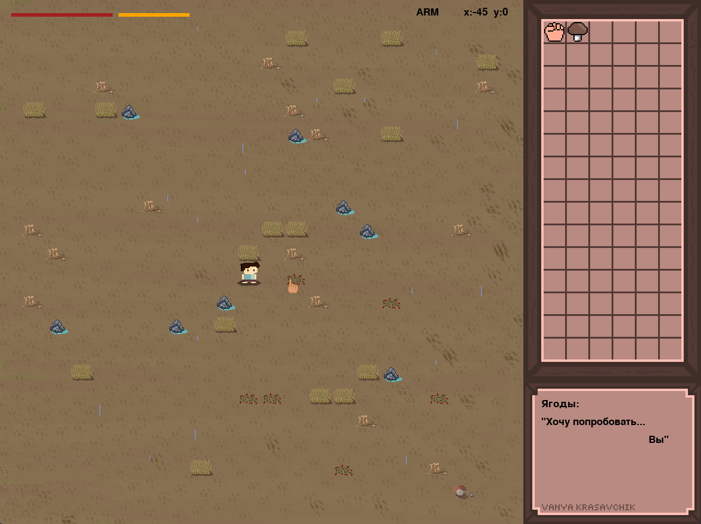

# 2D Survival Game 🎮🌲

Welcome to the **2D Survival Game** project!  
A solo pixel-art survival adventure built in Python using Pygame.

## 📝 Overview

- **Genre:** 2D Survival
- **Platform:** Windows (Executable provided), Python
- **Gameplay:** Solo
- **Engine:** [Pygame](https://www.pygame.org/)
- **Multiplayer:** Not supported

## ⚡ Features

- Single-player survival experience
- Developed with Python and Pygame
- Pre-built Windows executable (`.exe`) for instant play
- Simple controls and mechanics
- No external dependencies (besides Pygame)

## 🚀 Installation & Running

### Option 1: Play the Executable

1. Download the `.exe` file from the repository.
2. Double-click to launch the game—no installation required!

### Option 2: Run from Source

1. Clone this repository:
    ```bash
    git clone https://github.com/Ijne/Game-project.git
    ```
2. Install [Python](https://www.python.org/) (version 3.7+ recommended).
3. Install Pygame:
    ```bash
    pip install pygame
    ```
4. Run the main Python file:
    ```bash
    python main.py
    ```

## 🎮 Controls

- Use arrow keys or WASD to move.
- *(Add more controls here if needed.)*

## 🖼️ Screenshots

**Gameplay:**  
  


## 🏷️ Stickers & Sprites

**Some sprites:**  
  


## 💖 Credits

Developed by [Ijne](https://github.com/Ijne).

## 📄 License

This project is licensed under the MIT License. See [LICENSE](LICENSE) for details.

---

Enjoy surviving! 🌟🧭🍄  
